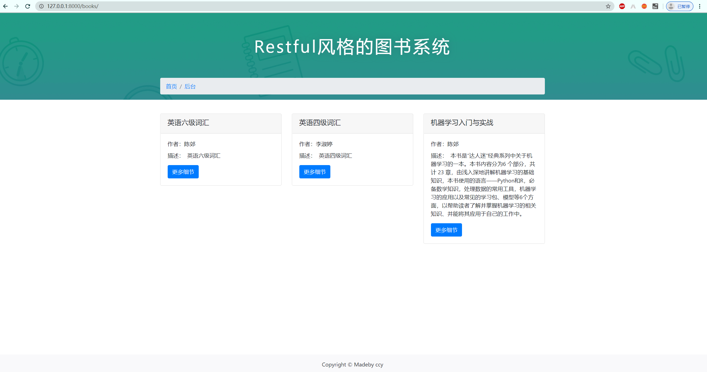
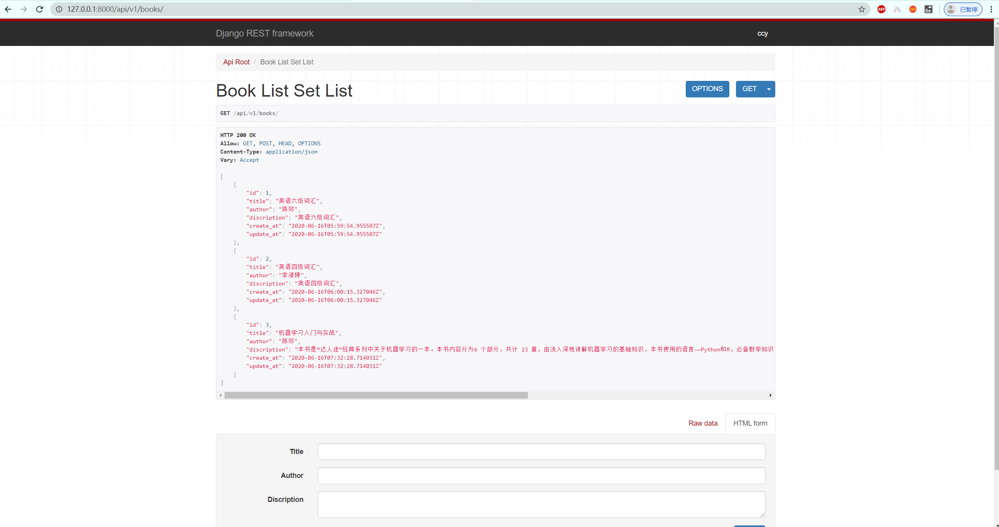

# bookManagerSystem
云南大学软件设计体系结构实验7，实现一个restful风格的图书web。前端使用bootstrap，后端使用Django+REST framework。

#### How to run

~~~
cd bookrec
python manager.py runserver
~~~

#### simple

##### 前端

##### Django REST framework

